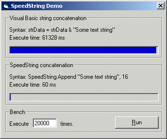

<div align="center">

## SpeedString concatenation


</div>

### Description

The SpeedString class boost performance on string concatenation. Almost every VB developer uses strValue = strValue & NewData as concatenation. The SpeedString class does the same, but a few hunderds times faster (something up to 1000 times).

This project demonstrates the use of my SpeedString class and compares the execution times of both methods.
 
### More Info
 
Syntax: SpeedString.Append StringValue, [StringLength]

The length is optional. Note that it also provides a faster method for the LEFT method.

Syntax: SpeedString.Data

Returns as string containing the concatenated data.


<span>             |<span>
---                |---
**Submitted On**   |2001-11-02 16:24:54
**By**             |[Robin Schuil](https://github.com/Planet-Source-Code/PSCIndex/blob/master/ByAuthor/robin-schuil.md)
**Level**          |Advanced
**User Rating**    |5.0 (55 globes from 11 users)
**Compatibility**  |VB 5\.0, VB 6\.0, ASP \(Active Server Pages\) 
**Category**       |[String Manipulation](https://github.com/Planet-Source-Code/PSCIndex/blob/master/ByCategory/string-manipulation__1-5.md)
**World**          |[Visual Basic](https://github.com/Planet-Source-Code/PSCIndex/blob/master/ByWorld/visual-basic.md)
**Archive File**   |[SpeedStrin328101122001\.zip](https://github.com/Planet-Source-Code/robin-schuil-speedstring-concatenation__1-28588/archive/master.zip)

### API Declarations

```
Private Declare Sub CopyMemory Lib "kernel32" Alias "RtlMoveMemory" (Destination As Any, Source As Any, ByVal Length As Long)
```


